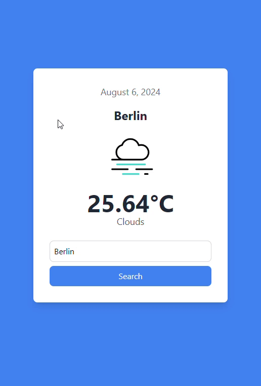

# React Weather Application

This is a simple weather application built using ReactJS. Users can get real-time weather information for the city they search for. If a user enters an invalid city name, an error notification is displayed.

## Features

- Real-time weather information
- Display weather data including temperature and weather conditions
- Customizable default city
- Error handling for invalid city names

## Technologies Used

- ReactJS
- CSS
- HTML
- JSX
- OpenWeatherMap API

## Prerequisites

Make sure you have the following installed on your system:

- Node.js
- npm (Node Package Manager)

## Getting Started

Follow these steps to get the project up and running on your local machine.

### Installation
# React + Vite

This template provides a minimal setup to get React working in Vite with HMR and some ESLint rules.

Currently, two official plugins are available:

- [@vitejs/plugin-react](https://github.com/vitejs/vite-plugin-react/blob/main/packages/plugin-react/README.md) uses [Babel](https://babeljs.io/) for Fast Refresh
- [@vitejs/plugin-react-swc](https://github.com/vitejs/vite-plugin-react-swc) uses [SWC](https://swc.rs/) for Fast Refresh
